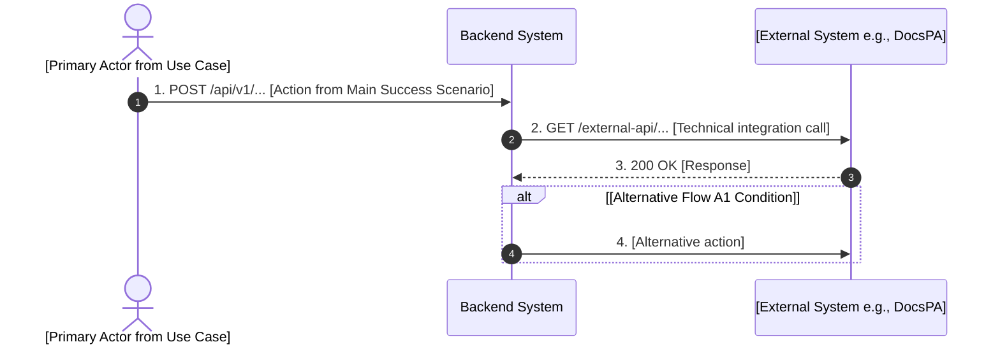

# Use Case Sequence Diagram

## Instructions

Read the specified Use Case document (e.g., `docs/use_cases/UC-XXX-*.md`) and the project's technical documentation (e.g., `docs/guidelines/Analisi_Tecnica*.md`). Extract the functional steps and map them to technical actors (APIs, Systems) to generate a Mermaid Sequence Diagram.

Append the generated diagram directly at the end of the specified Use Case document.

## DO NOT

- Guess external systems; always refer to the Technical Analysis document (e.g., "Sistemi esterni coinvolti" o "Saga") to identify the correct attore (e.g., DocsPA, ACS, BDF).
- Use generic descriptions like "Query API" if the exact HTTP endpoint is known. **Always write the exact HTTP Verb and Endpoint Path** (e.g. `POST /api/v1/istanze` or `GET /bdf/forme-dosaggio`) directly on the sequence arrows.
- Leave out Alternative Flows. They should be represented using `alt` or `opt` blocks.

## Template

Append this format to the bottom of the Use Case Markdown file:

## Workflow

1. Identify the target Use Case file (e.g., `UC-004`).
2. Read the Use Case file using the `view_file` tool to extract the Main Success Scenario and Alternative Flows.
3. Read the Technical Analysis documentation to map the functional steps to specific technical integrations or services (e.g., DocsPA, ACS, BDS).
4. Construct the Mermaid `sequenceDiagram` block.
5. Use the `replace_file_content` or `run_command` tool to append the Mermaid block to the bottom of the Use Case file.
6. Verify the appended Mermaid syntax is correct.
