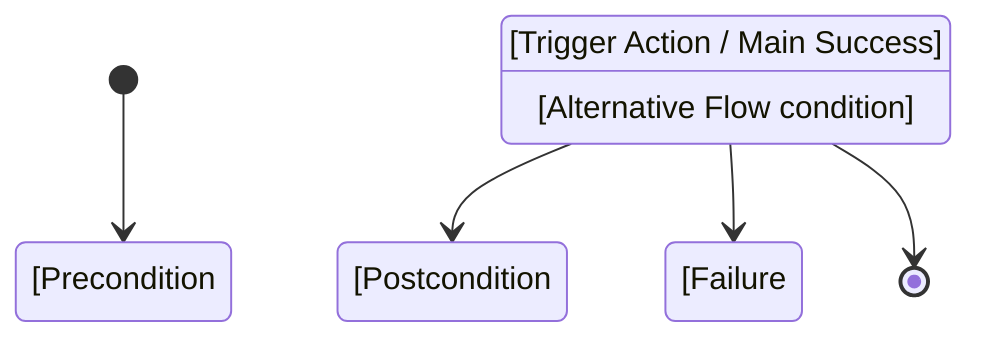

# Use Case State Diagram

## Instructions

Read the specified Use Case document (e.g., `docs/use_cases/UC-XXX-*.md`) and the project's technical documentation (e.g., `docs/guidelines/Analisi_Tecnica*.md`). Extract the Preconditions and Postconditions to identify state transitions of the core entity (e.g., "Draft" to "Submitted").

Cross-reference these states with the official Macchina a Stati (State Machine) section in the Technical Analysis document to ensure correct technical naming of states.

Append the generated diagram directly at the end of the specified Use Case document.

## DO NOT

- Invent new states. If the Use Case uses a colloquial term, map it to the official state name from the Technical Analysis document (e.g., mapping "Submitted" to `SOTTOMESSA`).
- Leave out Alternative Flows. If an alternative flow results in a failure state or prevents a transition, show it.

## Template

Append this format to the bottom of the Use Case Markdown file:

## Workflow

1. Identify the target Use Case file (e.g., `UC-004`).
2. Read the Use Case file using the `view_file` tool to extract Preconditions, Postconditions, and Alternative Flows.
3. Read the Technical Analysis documentation (specifically the State Machine section) to map the functional states to the actual technical system states (e.g., `BOZZA`, `APPROVATA`).
4. Construct the Mermaid `stateDiagram-v2` block.
5. Use the `replace_file_content` or `run_command` tool to append the Mermaid block to the bottom of the Use Case file.
6. Verify the appended Mermaid syntax is correct.
