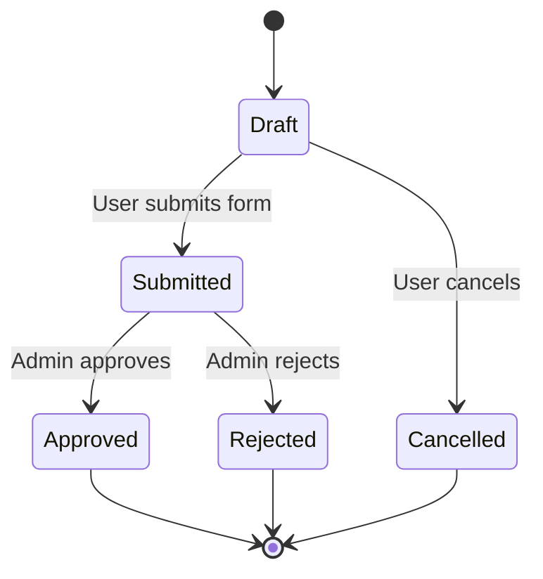

# Use Case State Diagram

## Instructions

Read the specified Use Case document (e.g., `docs/use_cases/UC-XXX-*.md`) and the project's architecture or domain documentation (e.g., `docs/architecture.md`, `docs/entity_model.md`). Extract the Preconditions and Postconditions to identify state transitions of the core entity (e.g., "Draft" to "Submitted").

If the project defines an official state machine in its documentation, cross-reference the Use Case states with the official state names to ensure consistency.

Append the generated diagram directly at the end of the specified Use Case document.

## DO NOT

- Invent new states. If the Use Case uses a colloquial term, map it to the official state name from the project's documentation (e.g., mapping "Sent" to `SUBMITTED`).
- Leave out Alternative Flows. If an alternative flow results in a failure state or prevents a transition, show it.

## Template

Append this format to the bottom of the Use Case Markdown file:

## Workflow

1. Identify the target Use Case file (e.g., `UC-004`).
2. Read the Use Case file to extract Preconditions, Postconditions, and Alternative Flows.
3. If available, read the project's architecture or domain documentation to map functional states to the actual technical system states.
4. Construct the Mermaid `stateDiagram-v2` block.
5. Append the Mermaid block to the bottom of the Use Case file.
6. Verify the appended Mermaid syntax is correct.
